# Deep Reinforcement Learning for WIG20 Stock Trading

Opis ten dotyczy projektu zrealizowanego w ramach pracy magisterskiej obronionej w Szkole Głównej Handlowej w Warszawie (SGH) na kierunku Analiza Danych - Big Data. 

**Temat pracy:** „Głębokie uczenie ze wzmocnieniem w handlu algorytmicznym: analiza efektywności w zmiennych uwarunkowaniach koniunkturalnych polskiego rynku akcji”

---

## Spis Treści
1. [Wstęp i Cel Projektu](#1-wstęp-i-cel-projektu)
2. [Zbiór Danych i Selekcja Walorów](#2-zbiór-danych-i-selekcja-walorów)
3. [Metodologia Walidacji Kroczącej (Walk-Forward Validation)](#3-metodologia-walidacji-kroczącej-walk-forward-validation)
4. [Inżynieria Cech i Preselekcja Zmiennych](#4-inżynieria-cech-i-preselekcja-zmiennych)
   - [Standaryzacja Danych Finansowych](#standaryzacja-danych-finansowych)
   - [Konstrukcja Zmiennych Objaśniających](#konstrukcja-zmiennych-objaśniających)
   - [Krocząca Transformacja Z-Score dla Wskaźników Fundamentalnych](#krocząca-transformacja-z-score-dla-wskaźników-fundamentalnych)
   - [Wieloetapowa Procedura Preselekcji Cech](#wieloetapowa-procedura-preselekcji-cech)
5. [Urealnione Środowisko Symulacyjne (StockTradingEnv)](#5-urealnione-środowisko-simulacyjne-stocktradingenv)
   - [Modyfikacje Autorskie (Dostosowanie do platformy XTB)](#modyfikacje-autorskie-dostosowanie-do-platformy-xtb)
   - [Logarytmiczna Funkcja Nagrody](#logarytmiczna-funkcja-nagrody)
6. [Metodyka Treningu i Strojenie Hiperparametrów](#6-metodyka-treningu-i-strojenie-hiperparametrów)
   - [Kryterium Walidacji: Wskaźnik Sortino](#kryterium-walidacji-wskaźnik-sortino)
   - [Optymalizacja Bayesowska (TPE w Optuna) ze Sterowaniem Wariancją Ziaren](#optymalizacja-bayesowska-tpe-w-optuna-ze-sterowaniem-wariancją-ziaren)
7. [Zarządzanie Stochastycznością: Komitety Wieloagentowe (Ensemble Learning)](#7-zarządzanie-stochastycznością-komitety-wieloagentowe-ensemble-learning)
   - [Uzasadnienie Statystyczne](#uzasadnienie-statystyczne)
   - [Warianty Agregacji Sygnałów](#warianty-agregacji-sygnałów)
8. [Wyniki Badań i Istotne Wnioski](#8-wyniki-badań-i-istotne-wnioski)
   - [Wyniki Strategii Referencyjnych (Benchmarków)](#wyniki-strategii-referencyjnych-benchmarków)
   - [Skuteczność Komitetów DRL i Filtrowanie Szumu](#skuteczność-komitetów-drl-i-filtrowanie-szumu)
   - [Analiza Zachowania podczas Krachu (Q1 2020) oraz Hossa Odbicia](#analiza-zachowania-podczas-krachu-q1-2020-oraz-hossa-odbicia)
9. [Kierunki Dalszych Prac](#9-kierunki-dalszych-prac)

---

## 1. Wstęp i Cel Projektu

Projekt bada zastosowanie zaawansowanych algorytmów **głębokiego uczenia ze wzmocnieniem (Deep Reinforcement Learning - DRL)** z rodziny Aktor-Krytyk do automatycznego handlu na polskim rynku akcji. W obliczu dynamicznych i nieliniowych zmian cen, tradycyjne metody alokacji portfela często okazują się niewystarczające. Głównym celem badania jest zweryfikowanie, czy i w jakim stopniu agenci uczenia ze wzmocnieniem potrafią dostosować swoje strategie decyzyjne do zmiennych i skrajnie zróżnicowanych faz rynkowych (hossy, bessy, trendów bocznych), reprezentowanych przez burzliwy rok 2020. 

W badaniu zaimplementowano, dostrojono i porównano pięć czołowych algorytmów DRL obsługujących ciągłe przestrzenie akcji:
*   **PPO (Proximal Policy Optimization)** — algorytm on-policy, charakteryzujący się stabilizacją aktualizacji polityki dzięki mechanizmowi przycinania gradientu (clipping).
*   **A2C (Advantage Actor-Critic)** — synchroniczny wariant klasycznej architektury Aktor-Krytyk optymalizujący stopień przewagi danej akcji nad średnim stanem.
*   **DDPG (Deep Deterministic Policy Gradient)** — deterministyczny algorytm off-policy dedykowany do ciągłych przestrzeni akcji, wykorzystujący bufor pamięci powtórek (replay buffer).
*   **TD3 (Twin Delayed Deep Deterministic Policy Gradient)** — ulepszona wersja DDPG, rozwiązująca problem systematycznego przeszacowywania wartości Q za pomocą podwójnych sieci krytyka oraz opóźnionej aktualizacji sieci aktora.
*   **SAC (Soft Actor-Critic)** — algorytm off-policy maksymalizujący entropię polityki rynkowej, co stymuluje eksplorację i zapobiega przedwczesnemu utknięciu w lokalnych ekstremach.

Badanie to wykracza poza standardowe, czysto teoretyczne ramy transakcyjne, wprowadzając unikalne autorskie modyfikacje środowiska symulacyjnego oraz metody uczenia zespołowego (Ensemble Learning), mające na celu zbliżenie symulacji transakcyjnych do rzeczywistych warunków rynkowych polskiego brokera.

---

## 2. Zbiór Danych i Selekcja Walorów

Próbę badawczą skonstruowano na bazie historycznego składu indeksu **WIG20** (największe i najbardziej płynne podmioty GPW w Warszawie) według stanu po korekcie kwartalnej z dnia **20 grudnia 2019 roku**. 

Z pierwotnego koszyka wykluczono cztery spółki, co było podyktowane rygorystycznymi wymaganiami algorytmów DRL odnośnie do ciągłości i symetrii szeregów czasowych:
1.  **Grupa Lotos S.A.** — wykluczona z powodu fuzji i przejęć oraz późniejszego wycofania z obrotu.
2.  **PGNiG S.A. (Polskie Górnictwo Naftowe i Gazownictwo)** — wykluczona z powodu procesów konsolidacyjnych (fuzja z PKN Orlen).
3.  **Play Communications S.A.** — wycofana z obrotu giełdowego w wyniku przejęcia przez inwestora strategicznego.
4.  **Dino Polska S.A.** — wykluczona ze względu na zbyt krótki staż giełdowy (debiut w 2017 roku), co uniemożliwiało pozyskanie jednolitych danych historycznych od dolnej granicy zbioru.

Ostateczna próba badawcza objęła **16 spółek**, które zachowały pełną ciągłość notowań w całym horyzoncie badawczym. Dolną granicę zbioru danych historycznych (wykorzystywanych do przygotowania cech wejściowych) wyznaczył debiut rynkowy spółki **Alior Bank S.A.** w grudniu 2012 roku — notowania dla całego portfela pobrano od początku **2013 roku**.

Do celów właściwej symulacji handlowej wybrano **rok 2020**, charakteryzujący się bezprecedensową zmiennością i występowaniem skrajnych, dynamicznych faz rynkowych związanych z wybuchem pandemii COVID-19:
1.  **Stabilizacja (02.01 – 14.02.2020):** Łagodny spadek średnich notowań portfela o **7,02%**.
2.  **Szok pandemiczny (17.02 – 13.03.2020):** Gwałtowna, paniczna deprecjacja wyceny aktywów o **40,20%**.
3.  **Odbicie rynkowe (16.03 – 01.07.2020):** Dynamiczne odreagowanie i wzrost średniej wartości portfela o ok. **47,00%**.
4.  **Trend boczny (01.07 – 01.10.2020):** Stabilizacja i znikoma korekta wartości portfela na poziomie **3,00%**.
5.  **Przecena jesienna / Druga fala (01.10 – 30.10.2020):** Silna destabilizacja wywołana powrotem restrykcji, skutkująca spadkiem wyceny o **18,44%**.
6.  **Hossa szczepionkowa (02.11 – 30.12.2020):** Dynamiczny i nieprzerwany rajd wzrostowy wywołany doniesieniami o szczepionkach, przynoszący spektakularną aprecjację portfela o **44,59%**.

### Otoczenie Rynkowe i Charakterystyka Danych
Poniższe wykresy obrazują specyfikę danych rynkowych oraz zachowanie głównych wskaźników referencyjnych i składowych portfela.

#### Wykres 1: Porównanie dynamiki indeksów S&P 500 oraz WIG20 w latach 2020-2025
Wykres ten przedstawia historyczny kontekst kształtowania się stóp zwrotu na rynku polskim w porównaniu do globalnego rynku akcji reprezentowanego przez indeks amerykański.

#### Wykres 2: Porównanie dynamiki zmian kursu USD/PLN oraz indeksu WIG20 w latach 2020-2025
Obrazuje relację między kursem walutowym (USD/PLN), odzwierciedlającym przepływy kapitału i poziom ryzyka systemowego, a wyceną indeksu największych polskich spółek.

#### Wykres 3: Skumulowane stopy zwrotu składowych portfela w 2020 roku
Wizualizacja ekstremalnego zróżnicowania stóp zwrotu poszczególnych 16 spółek wchodzących w skład portfela w trakcie burzliwego roku 2020, stanowiącego horyzont testowy.
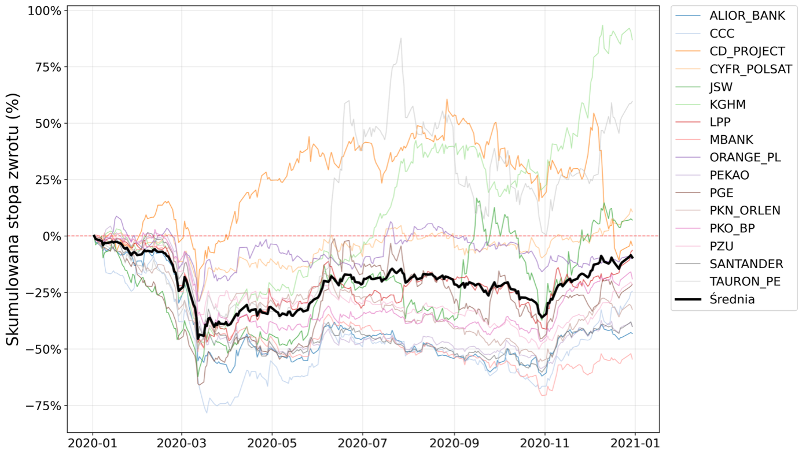

Dane zostały pozyskane z portali: **Stooq** (dzienne notowania OHLCV, S&P 500, USD/PLN, rentowność 10-letnich obligacji skarbowych), **BiznesRadar** (surowe kwartalne sprawozdania finansowe zawierające bilans, rachunek zysków i strat oraz rachunek przepływów pieniężnych) oraz serwisu autora wskaźnika **WIV20** (indeks zmienności implikowanej dla opcji na WIG20).

---

## 3. Metodologia Walidacji Kroczącej (Walk-Forward Validation)

Z uwagi na specyfikę finansowych szeregów czasowych, klasyczny podział na zbiór treningowy i testowy niesie za sobą ogromne ryzyko przeuczenia i tzw. wycieku informacji z przyszłości (Data Leakage). Aby temu zapobiec, w projekcie zaimplementowano **metodologię walidacji kroczącej (Walk-Forward Validation)**.

Pojedynczy blok badawczy obejmuje **25 kwartałów kalendarzowych** (łącznie 6 lat i 3 miesiące), które podzielono na trzy rozłączne podzbiory:
1.  **Okno treningowe (In-sample) [kwartały 1 - 23]:** Obejmuje 5 lat i 9 miesięcy. Służy do uczenia sieci neuronowych i optymalizacji wag polityki inwestycyjnej.
2.  **Okno walidacyjne (In-sample) [24. kwartał]:** Obejmuje 3 miesiące. Służy do okresowej oceny jakości modeli na danych niewidzianych w trakcie treningu i wyboru najlepszej checkpointowanej konfiguracji sieci.
3.  **Okno testowe (Out-of-sample) [25. kwartał]:** Obejmuje kolejne 3 miesiące. Stanowi fazę właściwej symulacji handlu, w której agent podejmuje wiążące decyzje inwestycyjne.

Po zakończeniu symulacji dla danego kwartału testowego, cały blok przesuwa się do przodu o 1 kwartał (3 miesiące), a proces treningu rozpoczyna się od nowa na zaktualizowanym zbiorze danych (tzw. retraining). Gwarantuje to regularną adaptację modeli do nowej dynamiki rynkowej. Do pokrycia pełnego roku 2020 zdefiniowano 4 niezależne iteracje przesunięcia okien.

#### Wykres 4: Przesuwne okna czasowe w metodzie walidacji kroczącej
Wizualizacja przesuwających się bloków czasowych (Trening, Walidacja, Test) dla 4 kolejnych iteracji pokrywających rok 2020.
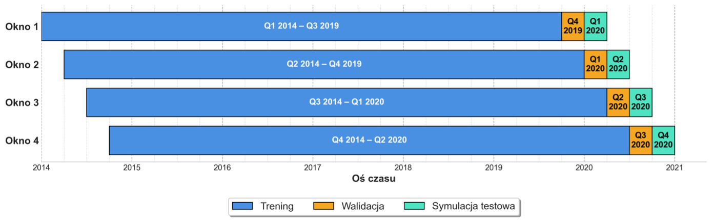

---

## 4. Inżynieria Cech i Preselekcja Zmiennych

### Standaryzacja Danych Finansowych
Ze względu na fundamentalne odmienności sprawozdawcze, proces agregacji danych z raportów kwartalnych podzielono na dwa niezależne nurty:
*   **Przedsiębiorstwa niefinansowe:** Klasyczny układ raportowania oparty na pozycjach: Przychody ze sprzedaży, Wynik operacyjny (EBIT), EBITDA, Wynik netto, Kapitał własny (uwzględniający udziały niekontrolujące zgodnie z MSSF 10), Aktywa ogółem oraz Zobowiązania ogółem (wyznaczane na podstawie tożsamości bilansowej jako Aktywa ogółem pomniejszone o Kapitał własny).
*   **Sektor finansowy (banki komercyjne):** Zastosowano specyficzne pozycje bilansowe i wynikowe: Przychody zdefiniowano jako całkowity dochód operacyjny (marża odsetkowa, wynik z prowizji, wynik handlowy i rewaluacji), EBIT (Wynik operacyjny podany wprost), Kapitały razem, Aktywa razem oraz Zobowiązania razem.

Operacyjne (OCF) oraz wolne (FCF) przepływy pieniężne pobrano bezpośrednio z raportów dla wszystkich podmiotów, niezależnie od przynależności sektorowej.

### Konstrukcja Zmiennych Objaśniających
Na bazie zebranych danych utworzono wektor ponad **110 zmiennych objaśniających (kandydatów)**, podzielonych na kategorie:
1.  **Wskaźniki rentowności i struktury finansowej:** ROE, marża netto, wskaźnik ogólnego zadłużenia, relacja OCF do zysku netto, EV/EBITDA, EV/EBIT.
2.  **Miary wyceny rynkowej:** P/E, P/S, P/BV, P/FCF (codzienne ceny zamknięcia odnoszone do raportów finansowych, z uwzględnieniem warunku logicznego: data publikacji raportu $\le$ data sesji giełdowej, eliminującego data leakage).
3.  **Wskaźniki techniczne:** Wskaźniki względne uniezależniające model od nominalnych poziomów cen, takie jak procentowe odchylenie ceny od średnich (SMA, EMA, GMMA), wskaźnik tempa zmian (ROC), procentowy wariant MACD (PPO), relatywny wskaźnik zmienności ATR podzielony przez cenę, oscylatory (RSI, Stochastic RSI), składowe systemu ADX (PDI, NDI, DX), relatywny wolumen obrotu (odniesiony do średniej 30-dniowej), OBV poddany standaryzacji, a także zaawansowane oscylatory BOP, CMO, QQE i znormalizowana pozycja ceny we wstęgach Bollingera.
4.  **Zmienne makroekonomiczne (kontekst rynkowy):** Stopa zwrotu S&P 500, zmiana rentowności 10-letnich polskich obligacji skarbowych, stopa zwrotu pary USD/PLN, indeks zmienności implikowanej WIV20.

### Krocząca Transformacja Z-Score dla Wskaźników Fundamentalnych
Bezpośrednie podanie bezwzględnych wartości wskaźników fundamentalnych (często niestacjonarnych i różniących się skalą o kilka rzędów wielkości) destabilizowałoby uczenie sieci. Aby ujednolicić przestrzeń cech, wszystkie wskaźniki fundamentalne poddano **kroczącej transformacji Z-Score** w dynamicznym oknie 252 dni handlowych (rok giełdowy):

$$Z_t = rac{X_t - \mu_{252}}{\sigma_{252}}$$

gdzie $X_t$ to bieżąca wartość wskaźnika, $\mu_{252}$ to średnia z ostatnich 252 sesji, a $\sigma_{252}$ to odchylenie standardowe z tego samego okresu. Wyniki transformacji poddano obcięciu (clipping) do sztywnego przedziału $[-5.5, 5.5]$ w celu neutralizacji wpływu wartości odstających.

**Uzasadnienie metody:** Raporty finansowe publikowane są raz na kwartał, co oznacza, że surowy wskaźnik fundamentalny (np. ROE) pozostaje niezmienny przez około 63 sesje. Bezpośrednie zasilenie sieci neuronowej takimi „płaskimi” danymi pozbawiłoby model dynamicznego kontekstu. Krocząca transformacja Z-Score eliminuje ten problem: choć licznik ($X_t$) pozostaje stały do nowej publikacji, to mianownik i odjęta średnia aktualizują się codziennie z każdym przesunięciem okna 252 sesji. Daje to płynnie ewoluującą zmienną, która w dniu publikacji raportu gwałtownie reaguje (jako odchylenie od trendu), a następnie łagodnie opada w miarę absorpcji nowej informacji przez historyczne okno.

### Wieloetapowa Procedura Preselekcji Cech
Podanie 110 zmiennych bezpośrednio do agenta DRL wywołałoby **klątwę wymiarowości (Curse of Dimensionality)**, drastycznie podnosząc wymagania obliczeniowe i destabilizując uczenie sieci przez obecność cech silnie skorelowanych. Wdrożono autorską procedurę selekcji cech:

1.  **Analiza korelacji rangowej:** Obliczono wewnątrzgrupową macierz korelacji rang Spearmana (zamieniając surowe wartości na rangi w obrębie każdej spółki niezależnie, co wyeliminowało błędy wynikające ze stałych różnic poziomów wyceny między podmiotami).
2.  **Klasteryzacja hierarchiczna:** Na bazie macierzy odległości $1 - |
ho|$ pogrupowano zmienne algorytmem klasteryzacji hierarchicznej z metodą najdalszego sąsiedztwa (complete linkage). Dendrogram odcięto na progu odległości **0,3**, co zagwarantowało, że korelacja rangowa pomiędzy wszystkimi zmiennymi wewnątrz pojedynczego klastra wynosiła co najmniej **0,7** (standardowa granica krytycznej współliniowości). Metoda ta pogrupowała 110 zmiennych w ok. 39–40 klastrów.

#### Wykres 5: Proces klasteryzacji hierarchicznej zmiennych kandydujących na przykładzie okna czasowego z indeksem 1
Wykres przedstawia strukturę powiązań korelacyjnych i grupowanie cech przy progu odcięcia 0,3 (czerwona linia przerywana).
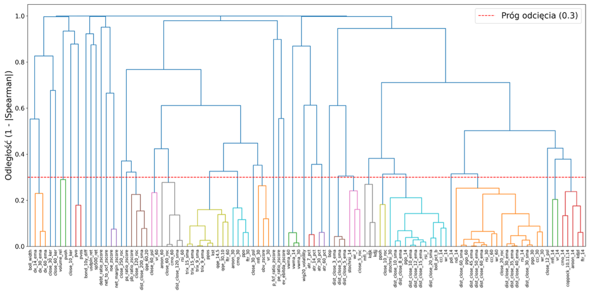

3.  **Selekcja liderów za pomocą Mutual Information (MI):** Z każdego klastra wyłoniono jednego reprezentanta (lidera) o najwyższej średniej wartości współczynnika informacji wzajemnej względem logarytmicznej stopy zwrotu w trzech horyzontach prognozy (5, 21, 63 dni w przód). MI, bazując na entropii, potrafi bezbłędnie identyfikować skomplikowane zależności nieliniowe, niewykrywalne dla klasycznej korelacji liniowej.
4.  **Modelowanie predykcyjne XGBoost i analiza wartości SHAP:** Zredukowany zbiór liderów klastrów posłużył jako wejście do modelu regresji XGBoost (płytkie drzewa max_depth = 5, learning_rate = 0.05, 150 estymatorów, subsample/colsample = 0,8 w celu zapobiegania dominacji cech). Do analizy istotności predykcyjnej wykorzystano wartości **SHAP (Shapley Additive exPlanations)** z teorii gier kooperacyjnych. Sprawiedliwie wyceniają one wkład marginalny każdej zmiennej, uwzględniając nieliniowe interakcje z innymi cechami.

#### Wykres 6: Ranking istotności predykcyjnej wskaźników wyznaczony na podstawie uśrednienia wartości Shapleya dla okna czasowego z indeksem 1
Wykres ilustruje uśredniony wkład marginalny SHAP dla poszczególnych cech wejściowych, ukazując silną asymetrię i dominację kluczowych wskaźników.
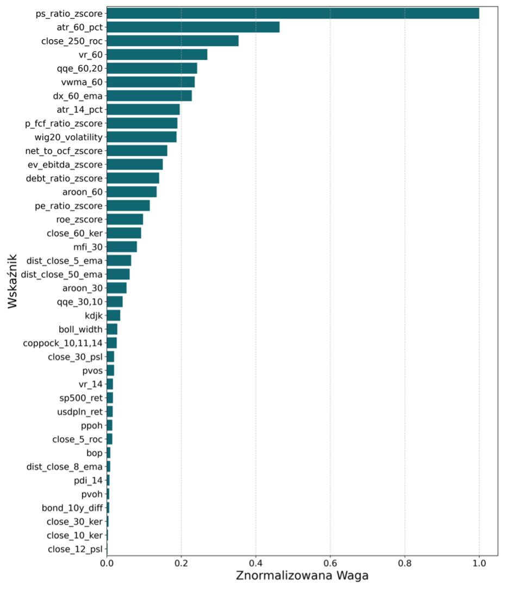

5.  **Kryterium selekcji 80%:** Zmienne uszeregowano malejąco według wartości SHAP i sekwencyjnie włączano do ostatecznego koszyka, aż ich skumulowany wpływ osiągnął próg **80% całkowitej mocy predykcyjnej**. Ograniczyło to przestrzeń stanów do zaledwie **13–14 kluczowych zmiennych**, drastycznie zwiększając stabilność optymalizacji sieci i zapobiegając przeuczeniu.

#### Wykres 7: Zestawienie wybranych zmiennych wraz z ich mocą predykcyjną w procesie preselekcji
Prezentuje dynamiczną ewolucję wyselekcjonowanego zbioru zmiennych w poszczególnych 4 oknach badawczych. Widoczny jest uniwersalny rdzeń wskaźników fundamentalnych (np. `ps_ratio_zscore`, `p_fcf_ratio_zscore`, `net_to_ocf_zscore`) oraz technicznych (np. `close_250_roc`, `aroon_60`, `atr_60_pct`, `qqe_60,20`, `vr_60`) utrzymujących się we wszystkich okresach.
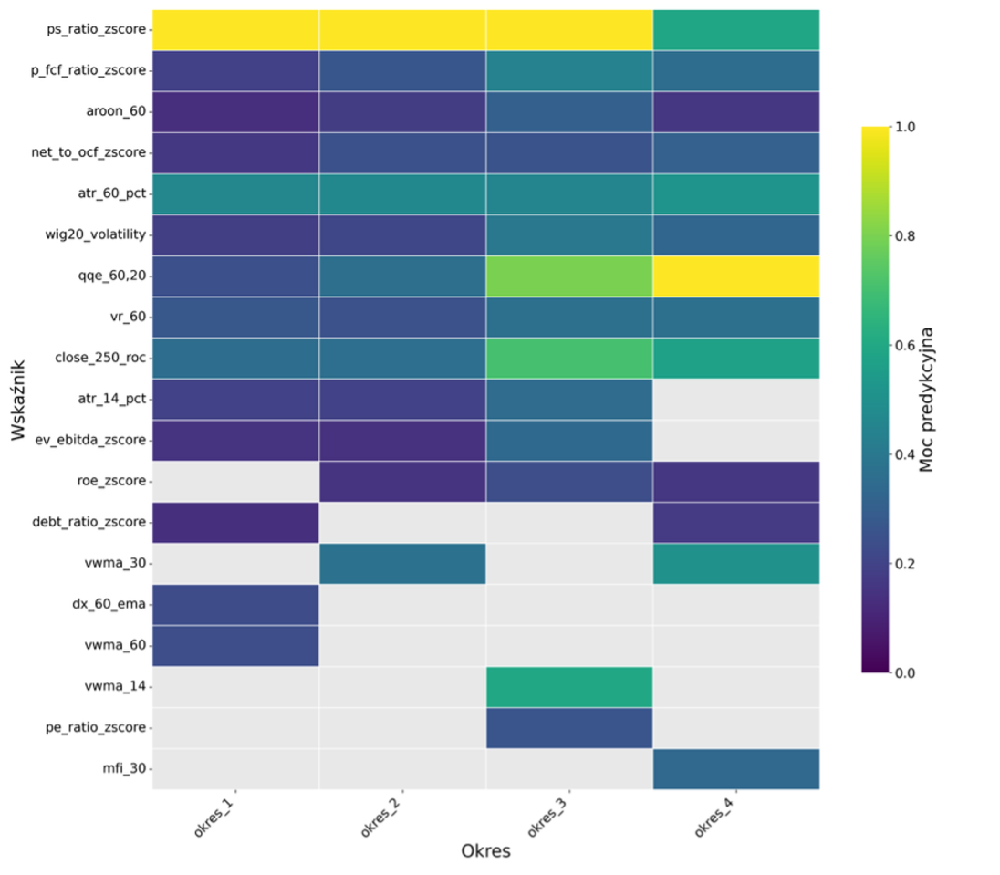

---

## 5. Urealnione Środowisko Symulacyjne (StockTradingEnv)

Proces transakcyjny sformalizowano jako **Proces Decyzyjny Markowa (MDP)**, w którym agent w każdym kroku $t$ postrzega stan środowiska $s_t$, podejmuje akcję $a_t$ (wektor decyzji o wymiarze $N=16$ z przedziału $[-1, 1]$), otrzymując nagrodę $r_t$ i przechodząc do stanu $s_{t+1}$. 

Wymiar wektora przestrzeni stanów wynosi $1 + 2N + NK$ (gdzie $N=16$ spółek, a $K$ to liczba wyselekcjonowanych wskaźników), przechowując: saldo gotówkowe, ceny zamknięcia spółek, wolumeny posiadanych akcji oraz wartości wskaźników dla każdego waloru.

### Modyfikacje Autorskie (Dostosowanie do platformy XTB)
Klasyczne środowisko transakcyjne `StockTradingEnv` z biblioteki FinRL opiera się na idealistycznych założeniach rynkowych (nieskończona płynność, natychmiastowe wykonanie zleceń), co generuje poważną lukę między symulacją a rzeczywistością (simulation-to-reality gap) i drastycznie pogarsza wyniki modeli w realnym tradingu. W pracy wprowadzono **szereg autorskich modyfikacji**, odzwierciedlających rzeczywisty regulamin transakcyjny oraz koszty platformy **XTB**:

1.  **Opóźnienie wykonania transakcji (Execution Delay):** W oryginalnym środowisku agent podejmuje decyzje i natychmiastowo realizuje je po cenach zamknięcia z tego samego dnia sesyjnego $t$. W rzeczywistości jest to niemożliwe. W zmodyfikowanym środowisku agent generuje decyzje transakcyjne na podstawie cen zamknięcia z dnia $t$, lecz transakcje są egzekwowane dopiero po **cenie otwarcia następnego dnia sesyjnego ($t+1$)**. Pozwala to uwzględnić ryzyko luki cenowej (overnight gap).
2.  **Mechanizm proporcjonalnego skalowania budżetu (Budget Scaling):** Oryginalne FinRL przetwarza zlecenia kupna w prostej pętli chronologicznej po indeksach spółek. Jeśli agent chce zaangażować więcej kapitału niż wynosi jego wolne saldo, zakupy są realizowane zachłannie, a zlecenia dla spółek z końca listy są odrzucane z powodu braku środków, co rażąco zaburza zamierzoną strukturę portfela. Wdrożono mechanizm, w którym sygnał sieci jest traktowany jako docelowa waga alokacji. System najpierw realizuje zlecenia sprzedaży (uwalniając kapitał), a w przypadku gdy łączna wartość planowanych zakupów przekracza saldo gotówkowe, **proporcjonalnie skaluje w dół wolumeny kupna dla wszystkich spółek**, zachowując strukturę wydatków zaprojektowaną przez agenta.
3.  **Wprowadzenie akcji ułamkowych i progów minimalnych:** Zrezygnowano z wymogu obrotu wyłącznie pełnymi jednostkami akcji na rzecz **handlu akcjami ułamkowymi (z precyzją do 4 miejsc po przecinku)**, co ma kluczowe znaczenie przy precyzyjnej alokacji w walory o wysokiej cenie jednostkowej (np. LPP S.A.). Jednocześnie wdrożono rygorystyczny próg minimalnej wartości zlecenia na poziomie **10 PLN** (zgodnie z ofertą XTB) — zlecenia poniżej tej kwoty są odrzucane (chyba że dochodzi do całkowitego zamknięcia otwartej pozycji, kiedy limit ten jest ignorowany).
4.  **Koszty transakcyjne:** Narzucono stałą prowizję na poziomie **0,10%** od wartości zlecenia dla każdej operacji kupna i sprzedaży. Choć XTB oferuje prowizję 0% do limitu obrotu 100 tys. EUR miesięcznie, narzucenie kosztu 0,1% jest rekomendowaną praktyką akademicką, odzwierciedlającą ukryte koszty rynkowe: spread cenowy oraz poślizg cenowy (slippage) podczas egzekucji zleceń.
5.  **Dynamiczny parametr HMAX:** Zamiast domyślnej stałej wartości maksymalnego wolumenu transakcji (co faworyzowało zaangażowanie kapitału w tańsze nominalnie akcje), parametr HMAX wyznaczany jest dynamicznie dla każdego waloru jako stosunek kapitału początkowego (100 000 PLN) do maksymalnej historycznej ceny akcji spółki z przypisanego okresu treningowego.

### Logarytmiczna Funkcja Nagrody
W miejsce domyślnej, bezwzględnej zmiany wartości portfela ($V_{t+1} - V_t$), która jest podatna na skalę kapitału i niestacjonarność, zaimplementowano **logarytmiczną stopę zwrotu**:

$$r_t = \ln\left(rac{V_{t+1}}{V_t}
ight)$$

Suma tak zdefiniowanych nagród z całego epizodu jest matematycznie równoważna logarytmowi z ilorazu kapitału końcowego do początkowego. Cechuje się ona addytywnością w czasie, wyższą stacjonarnością i dostarcza agentowi gęstej informacji zwrotnej (dense reward). Z uwagi na skrajnie małe dzienne wartości stóp zwrotu, nagrodę pomnożono przez parametr `reward_scaling = 100`. Dzięki temu wariancja nagród oscyluje wokół jedności, eliminując zjawisko zanikających lub eksplodujących gradientów w trakcie optymalizacji sieci.

---

## 6. Metodyka Treningu i Strojenie Hiperparametrów

### Kryterium Walidacji: Wskaźnik Sortino
Właściwy trening na danych in-sample obejmuje 100 epizodów (ok. 145 tys. kroków czasowych). W celu selekcji optymalnej postaci modelu wdrożono callback okresowo ewaluujący deterministyczną politykę agenta na zbiorze walidacyjnym. Jako docelową metrykę optymalizacyjną wybrano **wskaźnik Sortino**:

$$S = rac{R_p - R_f}{\sigma_d}$$

gdzie $R_p$ to zannualizowana stopa zwrotu, $R_f$ to stopa wolna od ryzyka (przyjęta jako 0), a $\sigma_d$ to odchylenie standardowe ujemnych stóp zwrotu (asymetryczna zmienność w dół). 

**Uzasadnienie metody:** Klasyczny wskaźnik Sharpe'a penalizuje zmienność symetrycznie — nakłada taką samą karę za dotkliwe spadki, jak i za niespodziewane, wysokie stopy zwrotu (które również podnoszą wariancję). Sortino asymetrycznie podchodzi do ryzyka: penalizuje wyłącznie zmienność spadkową (ryzyko strat), nie ograniczając nagradzania modeli za generowanie wysokich zysków w silnych trendach wzrostowych.

Normalizację obserwacji (salda, cen, wskaźników) zrealizowano za pomocą nakładki `VecNormalize` ze Stable Baselines 3, standaryzując stany do rozkładu o średniej bliskiej zeru i jednostkowej wariancji, z przycinaniem wartości skrajnych (clipping) do poziomu 10,0 odchyleń standardowych.

### Optymalizacja Bayesowska (TPE w Optuna) ze Sterowaniem Wariancją Ziaren
Uczenie ze wzmocnieniem wykazuje skrajną wrażliwość na hiperparametry oraz wysoką wariancję wyników wynikającą z **ziarna losowości** (losowa inicjalizacja wag sieci neuronowych, eksploracja środowiska). Ocena modelu na pojedynczym ziarnie losowości prowadzi do błędnych wniosków i maskuje problem przeuczenia do specyficznego szumu informacyjnego.

Aby temu zapobiec, zaimplementowano zaawansowaną procedurę strojenia:
*   Wykorzystano bibliotekę **Optuna** oraz estymator **TPE (Tree-structured Parzen Estimator)** jako algorytm optymalizacji bayesowskiej (budżet 50 prób; pierwsze 5 iteracji w trybie czysto losowym). TPE modeluje rozkład hiperparametrów probabilistycznie, maksymalizując oczekiwaną poprawę (Expected Improvement).
*   Każdą kombinację hiperparametrów ewaluowano równolegle na **trzech niezależnych ziarnach losowości**. 
*   **Funkcja celu:** Jako ostateczne kryterium oceny optymalizatora wybrano **medianę wskaźnika Sortino pomniejszoną o odchylenie standardowe** z uzyskanych trzech przebiegów. Pozwoliło to na automatyczne odrzucanie architektur o wysokiej wariancji (niestabilnych) na rzecz modeli o wysokiej powtarzalności.
*   W celu oszczędności czasu obliczeniowego zaimplementowano **MedianPruner** (n_startup_trials = 5, n_warmup_steps = 3). Pruner weryfikuje wyniki co 10 epizodów i przerywa próby gorsze od mediany dotychczasowych prób na dokładnie tym samym etapie uczenia i specyficznym ziarnie (kluczowe dla spójności porównań).

Strojeniu poddano: architekturę warstw ukrytych, funkcje aktywacji (Tanh, ReLU), regularyzację L2 (weight decay), współczynnik dyskonta ($\gamma$), tempo uczenia, rozmiar paczki (batch size), współczynnik entropii oraz specyficzne parametry algorytmów (np. horyzont planowania $n\_steps$, bufor pamięci, parametry szumu eksploracyjnego). Do parametrów o charakterze dopełnienia do jedności (np. $\gamma$ oraz $\lambda$ w GAE) zastosowano próbkowanie log-jednostajne dla ich dopełnienia ($1-\gamma$), co zagwarantowało pożądane zagęszczenie próbkowania blisko wartości 1.0.

Strojenie hiperparametrów przyniosło znaczący wzrost mediany wskaźnika Sortino we wszystkich oknach i dla wszystkich algorytmów w porównaniu z domyślnymi parametrami Stable Baselines 3.

---

## 7. Zarządzanie Stochastycznością: Komitety Wieloagentowe (Ensemble Learning)

### Uzasadnienie Statystyczne
Wyniki symulacji bazujących na sygnałach pojedynczych agentów przeszkolonych na różnych ziarnach losowości cechują się ogromną rozpiętością (krzywe kapitału od dotkliwych strat po wysokie zyski), co dowodzi, że pojedynczy model jest zbyt niestabilny, by powierzyć mu rzeczywisty kapitał.

#### Wykres 8: Zróżnicowanie przebiegu krzywych kapitału w symulacji testowej bazującej na sygnałach pojedynczych agentów (100 przebiegów)
Wykres ten obrazuje ogromną wariancję i rozrzut wyników pojedynczych modeli wytrenowanych na identycznych danych i hiperparametrach, a różniących się wyłącznie ziarnem losowości.
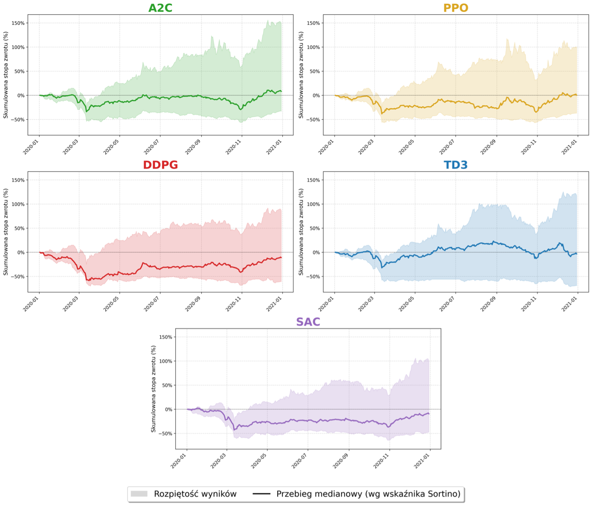

W celu redukcji wariancji wdrożono **metody uczenia zespołowego (Ensemble Learning)**, tworząc komitety wieloagentowe. Podejście to opiera się na twardych fundamentach matematycznych:
*   **Prawo Wielkich Liczb:** Pojedynczy przebieg uczenia stochastycznego jest tylko jedną realizacją zmiennej losowej. Zgodnie z PWL, średnia arytmetyczna z próby niezależnych realizacji dąży asymptotycznie do jej stabilnej wartości oczekiwanej wraz ze wzrostem liczebności komitetu $N$.
*   **Redukcja wariancji estymatorów:** Dla sumy $N$ zmiennych o równej wariancji $\sigma^2$ i średnim współczynniku korelacji $
ho$, wariancja uśrednionego sygnału wyraża się wzorem:
    $$	ext{Var}(ar{X}) = 
ho \sigma^2 + rac{1 - 
ho}{N} \sigma^2$$
    Gdy liczebność komitetu $N$ rośnie, drugi człon dąży do zera, a całkowita wariancja zespołu dąży asymptotycznie do $
ho \sigma^2$. Ponieważ modele wykazują zróżnicowane mapowania stanów (generują błędy o korelacji $
ho < 1$ dzięki stochastyczności uczenia), uśrednienie sygnałów gwarantuje silne obniżenie wariancji wyjściowej decyzji inwestycyjnej.

### Warianty Agregacji Sygnałów
Zaimplementowano trzy warianty tworzenia komitetów (wielkość komitetu badano w zakresie od $N=1$ do $N=50$ przy użyciu metodologii bootstrappingu ze zwracaniem, $B=30$ powtórzeń):
1.  **Komitet zwycięski (WIN - Winner):** W każdym kwartale testowym kapitał alokowany jest wyłącznie na bazie decyzji tego komitetu bazowego, który w poprzedzającym oknie walidacyjnym uzyskał najwyższą medianę Sortino. Pozwala to na elastyczną rotację modeli w zależności od panującego reżimu rynkowego.
2.  **Komitet uśredniony (AVG - Average):** Prosta średnia arytmetyczna sygnałów decyzyjnych (z przedziału $[-1, 1]$) generowanych przez wchodzące w jego skład komitety bazowe, mająca na celu maksymalną dywersyfikację stylów inwestycyjnych.
3.  **Komitet ważony funkcją Softmax (SMOOTHED):** Wariant, w którym wagę (siłę głosu) poszczególnych algorytmów wyznacza się za pomocą funkcji Softmax zaaplikowanej do ich wskaźników Sortino z okna walidacyjnego. Priorytetyzuje to modele o najwyższej historycznej skuteczności.

### Analiza Stabilności Sygnału
Wpływ liczebności komitetów ($N$) na redukcję szumu stochastycznego przedstawiają poniższe wykresy.

#### Wykres 9: Wpływ liczebności komitetów (N) na odchylenia standardowe surowych sygnałów
Wizualizuje empiryczny spadek odchylenia standardowego surowych sygnałów transakcyjnych wraz ze wzrostem liczby agentów w komitecie, co potwierdza pochłanianie szumu stochastycznego.
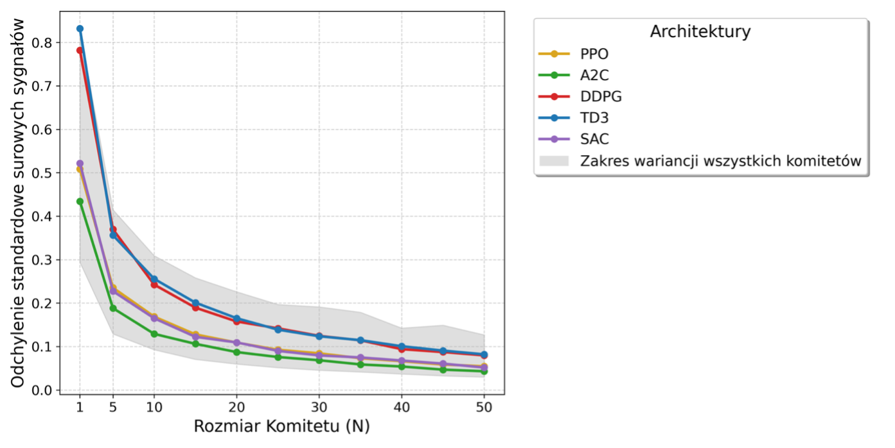

#### Wykres 10: Średnia bezwzględna zmiana surowych sygnałów (MAC) w zależności od liczebności komitetów (N)
MAC mierzy średnią różnicę sygnałów między komitetem o rozmiarze $N$ a $N-	ext{poprzednim}$. Wykres pokazuje silne wyhamowanie zmian w okolicach $N \ge 20$, choć krzywa opada aż do $N = 50$, wskazując na stałe korzyści z powiększania komitetu.
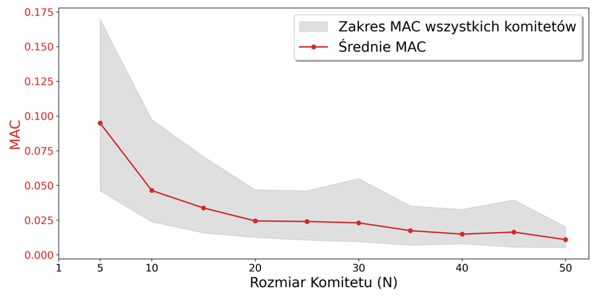

---

## 8. Wyniki Badań i Istotne Wnioski

### Wyniki Strategii Referencyjnych (Benchmarków)
Podczas gdy rok 2020 przyniósł załamanie rynkowe, klasyczne pasywne i aktywne strategie alokacji odniosły dotkliwe straty:
*   **Buy&Hold (pasywny rynek):** Skumulowana stopa zwrotu wyniosła **-8,87%** przy maksymalnym obsunięciu kapitału (Max Drawdown) równym **-44,86%**.
*   **Min-Variance (portfel minimalnej wariancji Markowitza):** Wynik na poziomie **-13,57%** przy obsunięciu **-40,33%**.
*   **Mean-Semivariance (optymalizacja wskaźnika Sortino in-sample):** Wynik na poziomie **-4,37%** przy maksymalnym obsunięciu **-44,41%**. Strategia ta zachowywała się jak portfel momentum, silnie alokując w CD Projekt S.A., co przełożyło się na dotkliwe straty podczas grudniowego krachu wyceny tej spółki.

#### Wykres 11: Przebieg krzywych kapitału w czasie dla benchmarków
Wizualizacja zachowania klasycznych strategii referencyjnych w 2020 roku, ukazująca silne obsunięcia w marcu i grudniu.
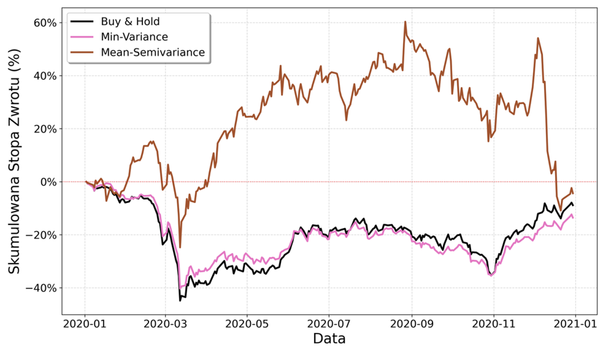

### Skuteczność Komitetów DRL i Filtrowanie Szumu
Wprowadzenie uczenia zespołowego diametralnie zmieniło profil efektywności inwestycyjnej. Poniższe wykresy i analizy statystyczne potwierdzają wybitną przewagę uśrednionych modeli DRL nad tradycyjnymi benchmarkami.

#### Wykres 12: Zbieżność metryk jakości strategii inwestycyjnych względem rozmiaru komitetów (N)
Wraz ze wzrostem $N$ następuje drastyczne zawężenie rozrzutu wyników (Sharpe'a, Sortino, Calmara, Stopy Zwrotu) oraz wyraźny wzrost i ustabilizowanie ich median na poziomach znacznie przekraczających wyniki benchmarków.
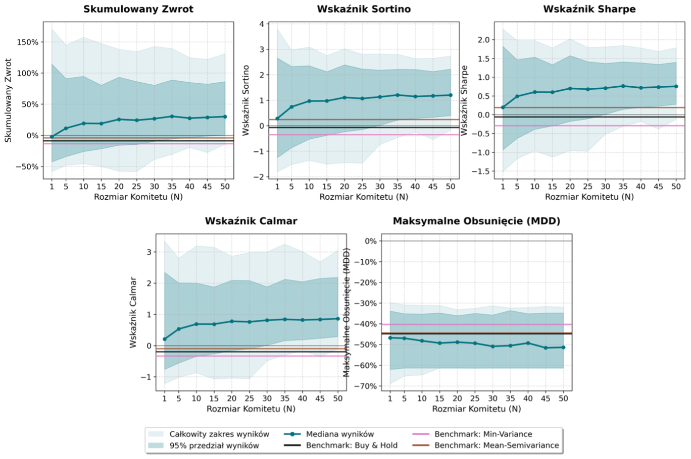

#### Wykres 13: Porównanie rozkładów gęstości uzyskanych metryk przez komitety o liczebności N = 1 oraz N = 50
Dla $N=1$ rozkłady są płaskie o dużej wariancji (odchylenie standardowe stóp zwrotu rzędu 0,38), z dużą masą poniżej zera. Dla $N=50$ rozkłady są silnie skoncentrowane wokół wysokich, dodatnich wartości średnich (odchylenie standardowe spada do 0,23, a średnia stopa zwrotu rośnie z 7% do 34%).
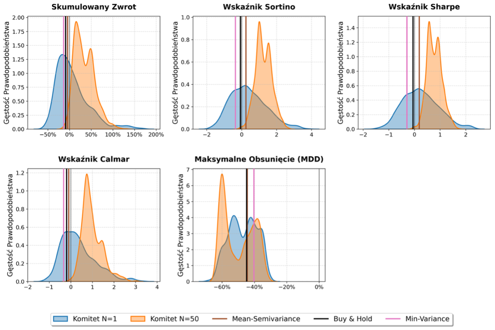

#### Wykres 14: Wpływ liczebności komitetów (N) na odsetek instancji przewyższających benchmark Buy&Hold oraz generujących dodatnią stopę zwrotu
Przy $N=1$ tylko 59,6% modeli pokonuje pasywny rynek, a zaledwie 47,6% generuje dodatni zysk. Zwiększenie rozmiaru komitetu do $N=50$ gwarantuje niemal pewną przewagę rynkową: **99,6% komitetów pokonuje Buy&Hold**, a **97,6% kończy rok z dodatnią stopą zwrotu** (analogiczną, bliską jedności skuteczność odnotowano dla metryk skorygowanych o ryzyko).
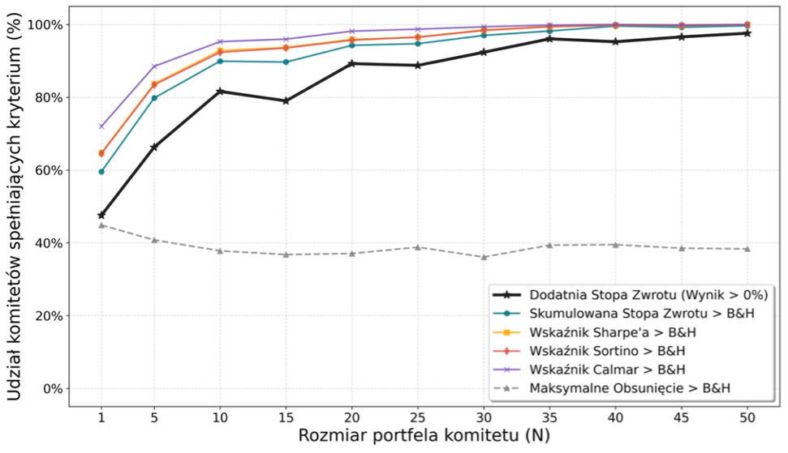

### Analiza Zachowania podczas Krachu (Q1 2020) oraz Hossa Odbicia
Mimo wybitnych ostatecznych stóp zwrotu, modele wykazały istotną słabość w kontroli ryzyka spadkowego: zaledwie 38,31% instancji komitetów o rozmiarze $N=50$ zdołało ograniczyć maksymalne obsunięcie kapitału skuteczniej niż pasywny rynek Buy&Hold, a w starciu z portfelem minimalnej wariancji odsetek ten spadł do 24,22%.

Przyczynę tego zjawiska wyjaśnia analiza dynamiczna:

#### Wykres 15: Obszar przebiegu krzywych kapitału w 30 iteracjach komitetów o liczebności N = 50 na tle benchmarków
Krzywe kapitału komitetów w okresie paniki pandemicznej (Q1 2020) podążają bezpośrednio za spadkowym trendem szerokiego rynku, notując dotkliwe obsunięcia rzędu 32–61%.
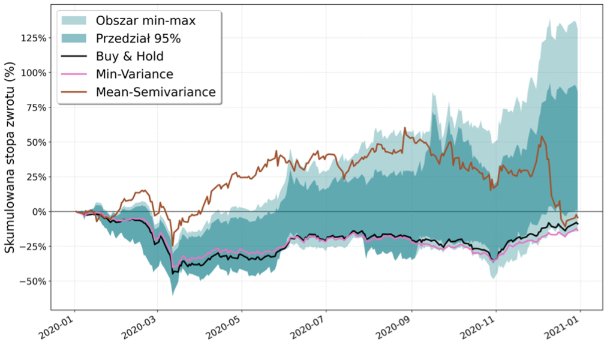

#### Wykres 16: Dynamika zmian cen akcji spółek wchodzących w skład portfela w Q1 2020
Pokazuje gwałtowny i zsynchronizowany spadek cen niemal wszystkich walorów w pierwszym kwartale, eliminujący korzyści z tradycyjnej dywersyfikacji.
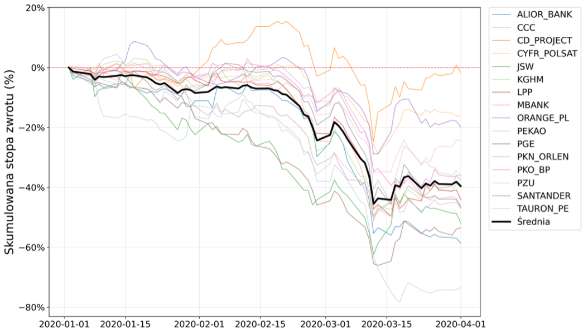

**Kluczowa obserwacja:** Agenci DRL wykazują opóźnienie w detekcji nagłych, bezprecedensowych krachów i nie potrafią odpowiednio szybko ewakuować kapitału w 100% do bezpiecznej gotówki, przez co w pełni partycypują w pierwszej fazie paniki rynkowej. Jednakże, w momencie wejścia rynku w fazę dynamicznego ożywienia (od Q2 2020), agenci wykazują wybitną zdolność do **agresywnej i niezwykle trafnej alokacji środków w spółki o najsilniejszym zidentyfikowanym potencjale wzrostowym**. Pozwala to komitetom z nawiązką odrobić straty z pierwszego kwartału i wygenerować spektakularne stopy zwrotu na koniec roku.

Najwyższą efektywnością wykazał się **komitet zwycięski (WIN) łączący algorytmy A2C, PPO oraz TD3** przy liczebności $N=50$. Wypracował on medianę skumulowanej stopy zwrotu na poziomie **86,00%** oraz wskaźnik Sortino równy **2,10** (stopy zwrotu wahały się w przedziale od 50% do 130% w zależności od ziaren losowych), tworząc kolosalną nadwyżkę nad ujemnymi wynikami tradycyjnych strategii.

#### Wykres 17: Obszar przebiegu krzywych kapitału w 30 iteracjach komitetu o najwyższej medianie metryk jakości (liczebność N = 50) na tle benchmarków
Wykres przedstawia spektakularną trajektorię odrabiania strat i maksymalizacji zysków przez zwycięski komitet wieloagentowy (A2C + PPO + TD3) w fazie odbicia rynkowego.
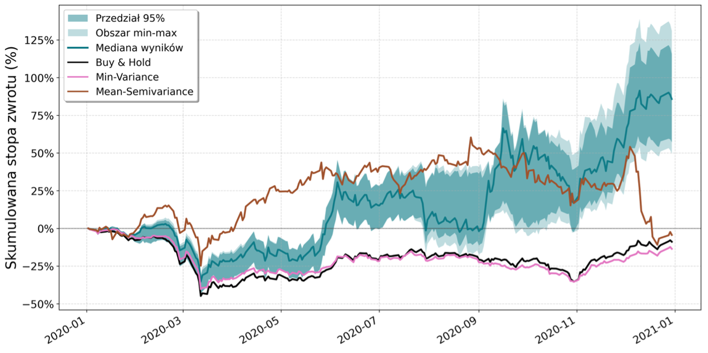

---

## 9. Kierunki Dalszych Prac

Przeprowadzone badanie otwiera obiecujące perspektywy rozwoju systemów handlu automatycznego na polskim rynku kapitałowym, jednocześnie definiując obszary wymagające dalszych prac badawczych:
1.  **Integracja Alternatywnych Źródeł Danych (NLP):** Wzbogacenie przestrzeni stanów o analizę sentymentu rynkowego z wiadomości finansowych, raportów analitycznych oraz mediów społecznościowych przy użyciu dużych modeli językowych (LLM) lub technik analizy tekstu.
2.  **Projektowanie Zaawansowanych Funkcji Nagrody:** Eksperymentowanie z funkcjami nagrody bezpośrednio uwzględniającymi miary ryzyka (np. nagroda oparta bezpośrednio o wskaźnik Sortino lub Calmara obliczany na kroczącym oknie in-sample), co mogłoby stymulować agentów do lepszej ochrony kapitału w fazach krachu.
3.  **Prognozowanie Efektywności Komitetów A Priori:** Opracowanie modeli predykcyjnych (klasyfikatorów lub regresorów nadzorowanych) zdolnych do szacowania przyszłej skuteczności konkretnej kompozycji komitetu na podstawie bieżących metryk rynkowych i makroekonomicznych, przed ekspozycją na realne ryzyko rynkowe.
4.  **Wyjaśnialna Sztuczna Inteligencja (XAI) w RL:** Zaimplementowanie metod interpretacji decyzji agentów (np. dynamiczne wartości SHAP wyliczane w każdym kroku czasowym dla sieci neuronowej aktora), co stanowi kluczowy warunek dopuszczenia i pełnej adaptacji systemów głębokiego uczenia ze wzmocnieniem przez instytucje finansowe i fundusze inwestycyjne.
