# Deep Reinforcement Learning for WIG20 Stock Trading

🇵🇱 Polish version available [here](README_pl.md)

**Thesis Title:** "Deep Reinforcement Learning in Algorithmic Trading: Performance Analysis under Variable Market Conditions of the Polish Stock Exchange"

---

## Table of Contents
1. [Introduction and Project Objective](#1-introduction-and-project-objective)
2. [Dataset and Asset Selection](#2-dataset-and-asset-selection)
3. [Walk-Forward Validation Methodology](#3-walk-forward-validation-methodology)
4. [Feature Engineering and Variable Pre-selection](#4-feature-engineering-and-variable-pre-selection)
   - [Financial Data Standardization](#financial-data-standardization)
   - [Construction of Explanatory Variables](#construction-of-explanatory-variables)
   - [Rolling Z-Score Transformation for Fundamental Indicators](#rolling-z-score-transformation-for-fundamental-indicators)
   - [Multi-stage Feature Pre-selection Procedure](#multi-stage-feature-pre-selection-procedure)
5. [Realistic Simulation Environment (StockTradingEnv)](#5-realistic-simulation-environment-stocktradingenv)
   - [Proprietary Modifications (Adaptation to the XTB platform)](#proprietary-modifications-adaptation-to-the-xtb-platform)
   - [Logarithmic Reward Function](#logarithmic-reward-function)
6. [Training Methodology and Hyperparameter Tuning](#6-training-methodology-and-hyperparameter-tuning)
   - [Validation Criterion: Sortino Ratio](#validation-criterion-sortino-ratio)
   - [Bayesian Optimization (TPE in Optuna) with Seed Variance Control](#bayesian-optimization-tpe-in-optuna-with-seed-variance-control)
7. [Stochasticity Management: Multi-agent Ensembles (Ensemble Learning)](#7-stochasticity-management-multi-agent-ensembles-ensemble-learning)
   - [Statistical Rationale](#statistical-rationale)
   - [Signal Aggregation Variants](#signal-aggregation-variants)
   - [Signal Stability Analysis](#signal-stability-analysis)
8. [Research Results and Key Findings](#8-research-results-and-key-findings)
   - [Reference Strategy (Benchmark) Results](#reference-strategy-benchmark-results)
   - [Effectiveness of DRL Ensembles and Noise Filtering](#effectiveness-of-drl-ensembles-and-noise-filtering)
   - [Behavior Analysis during the Crash (Q1 2020) and the Rebound Bull Market](#behavior-analysis-during-the-crash-q1-2020-and-the-rebound-bull-market)
9. [Future Work Directions](#9-future-work-directions)

---

## 1. Introduction and Project Objective

The project investigates the application of advanced **Deep Reinforcement Learning (DRL)** algorithms from the Actor-Critic family to automated trading on the Polish stock market. In the face of dynamic and nonlinear price changes, traditional portfolio allocation methods often prove insufficient. The main objective of the study is to verify whether and to what extent reinforcement learning agents can adapt their decision-making strategies to variable and extremely diverse market phases (bull markets, bear markets, sideways trends), represented by the turbulent year 2020. 

The study implemented, tuned, and compared five leading DRL algorithms supporting continuous action spaces:
*   **PPO (Proximal Policy Optimization)** — an on-policy algorithm characterized by policy update stabilization through a gradient clipping mechanism.
*   **A2C (Advantage Actor-Critic)** — a synchronous variant of the classic Actor-Critic architecture optimizing the advantage of a given action over the average state.
*   **DDPG (Deep Deterministic Policy Gradient)** — a deterministic off-policy algorithm dedicated to continuous action spaces, utilizing a replay buffer.
*   **TD3 (Twin Delayed Deep Deterministic Policy Gradient)** — an improved version of DDPG, solving the problem of systematic Q-value overestimation using twin critic networks and delayed actor network updates.
*   **SAC (Soft Actor-Critic)** — an off-policy algorithm maximizing market policy entropy, which stimulates exploration and prevents premature convergence to local extrema.

This research goes beyond standard, purely theoretical trading frameworks by introducing unique, proprietary modifications to the simulation environment and utilizing Ensemble Learning methods, aiming to bridge the gap between trading simulations and the actual market conditions of a Polish broker.

---

## 2. Dataset and Asset Selection

The research sample was constructed based on the historical composition of the **WIG20** index (the largest and most liquid entities on the Warsaw Stock Exchange) as of the quarterly adjustment on **December 20, 2019**. 

Four companies were excluded from the original basket, dictated by the rigorous requirements of DRL algorithms regarding the continuity and symmetry of time series:
1.  **Grupa Lotos S.A.** — excluded due to mergers and acquisitions and subsequent delisting.
2.  **PGNiG S.A. (Polskie Górnictwo Naftowe i Gazownictwo)** — excluded due to consolidation processes (merger with PKN Orlen).
3.  **Play Communications S.A.** — delisted following an acquisition by a strategic investor.
4.  **Dino Polska S.A.** — excluded due to a stock market history that was too short (debut in 2017), which made it impossible to obtain uniform historical data from the lower bound of the dataset.

The final research sample included **16 companies** that maintained full trading continuity throughout the research horizon. The lower bound of the historical dataset (used for preparing input features) was marked by the market debut of **Alior Bank S.A.** in December 2012 — quotes for the entire portfolio were downloaded from the beginning of **2013**.

For the purpose of the actual trading simulation, the **year 2020** was selected, characterized by unprecedented volatility and the occurrence of extreme, dynamic market phases associated with the outbreak of the COVID-19 pandemic:
1.  **Stabilization (02.01 – 14.02.2020):** A mild decline in average portfolio quotes of **7.02%**.
2.  **Pandemic Shock (17.02 – 13.03.2020):** A sudden, panic-driven depreciation of asset valuations by **40.20%**.
3.  **Market Rebound (16.03 – 01.07.2020):** A dynamic recovery and an increase in average portfolio value by approx. **47.00%**.
4.  **Sideways Trend (01.07 – 01.10.2020):** Stabilization and a negligible portfolio value correction at the level of **3.00%**.
5.  **Autumn Sell-off / Second Wave (01.10 – 30.10.2020):** Severe destabilization caused by the return of restrictions, resulting in a valuation drop of **18.44%**.
6.  **Vaccine Bull Market (02.11 – 30.12.2020):** A dynamic and uninterrupted upward rally triggered by vaccine reports, bringing a spectacular portfolio appreciation of **44.59%**.

#### Cumulative returns of portfolio components in 2020
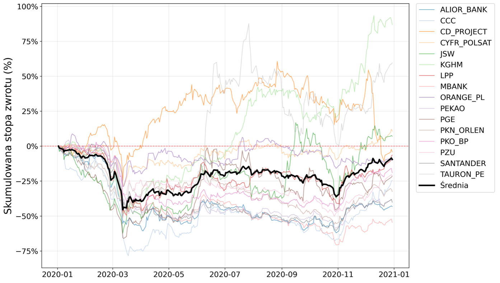

Data were acquired from the following portals: **Stooq** (daily OHLCV quotes, S&P 500, USD/PLN, 10-year treasury bond yields), **BiznesRadar** (raw quarterly financial statements containing the balance sheet, income statement, and cash flow statement), and the website of the author of the **WIV20** indicator (implied volatility index for WIG20 options).

---

## 3. Walk-Forward Validation Methodology

Due to the specific nature of financial time series, the classic split into training and test sets carries a massive risk of overfitting and Data Leakage. To prevent this, the project implemented the **Walk-Forward Validation** methodology.

A single research block covers **25 calendar quarters** (a total of 6 years and 3 months), which were divided into three disjoint subsets:
1.  **Training Window (In-sample) [quarters 1 - 23]:** Covers 5 years and 9 months. Used for training neural networks and optimizing investment policy weights.
2.  **Validation Window (In-sample) [24th quarter]:** Covers 3 months. Used for periodic evaluation of model quality on unseen data during training and selection of the best checkpointed network configuration.
3.  **Test Window (Out-of-sample) [25th quarter]:** Covers the subsequent 3 months. Constitutes the actual trading simulation phase, during which the agent makes binding investment decisions.

After the simulation for a given test quarter is completed, the entire block shifts forward by 1 quarter (3 months), and the training process starts anew on the updated dataset (retraining). This guarantees regular adaptation of models to new market dynamics. To cover the entire year of 2020, 4 independent iterations of window shifts were defined.

#### Sliding time windows in the walk-forward validation method
Visualization of sliding time blocks (Train, Validation, Test) for 4 consecutive iterations covering the year 2020.
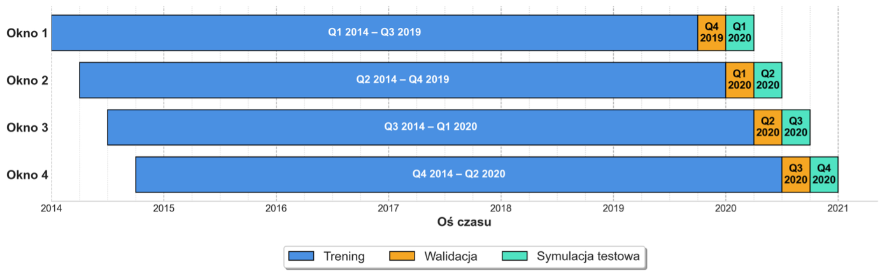

---

## 4. Feature Engineering and Variable Pre-selection

### Financial Data Standardization
Due to fundamental reporting differences, the process of aggregating data from quarterly reports was divided into two independent streams:
*   **Non-financial enterprises:** A classic reporting layout based on items: Sales Revenue, Operating Profit (EBIT), EBITDA, Net Profit, Equity (including non-controlling interests in accordance with IFRS 10), Total Assets, and Total Liabilities (determined based on the balance sheet identity as Total Assets minus Equity).
*   **Financial sector (commercial banks):** Specific balance sheet and income items were applied: Revenues were defined as total operating income (net interest income, fee and commission income, trading and revaluation income), EBIT (Operating profit reported directly), Total Equity, Total Assets, and Total Liabilities.

Operating (OCF) and free (FCF) cash flows were extracted directly from reports for all entities, regardless of their sector affiliation.

### Construction of Explanatory Variables
Based on the collected data, a vector of over **110 explanatory variables (candidates)** was created, divided into categories:
1.  **Profitability and financial structure ratios:** ROE, net margin, total debt ratio, OCF to net income ratio, EV/EBITDA, EV/EBIT.
2.  **Market valuation metrics:** P/E, P/S, P/BV, P/FCF (daily closing prices related to financial reports, considering the logical condition: report publication date $\le$ trading session date, eliminating data leakage).
3.  **Technical indicators:** Relative indicators independent of nominal price levels, such as percentage deviation of price from moving averages (SMA, EMA, GMMA), Rate of Change (ROC), percentage variant of MACD (PPO), relative volatility indicator ATR divided by price, oscillators (RSI, Stochastic RSI), components of the ADX system (PDI, NDI, DX), relative trading volume (related to a 30-day average), standardized OBV, as well as advanced BOP, CMO, QQE oscillators and normalized price position within Bollinger Bands.
4.  **Macroeconomic variables (market context):** S&P 500 rate of return, change in 10-year Polish treasury bond yields, USD/PLN rate of return, WIV20 implied volatility index.

### Rolling Z-Score Transformation for Fundamental Indicators
Directly feeding absolute values of fundamental indicators (often non-stationary and differing in scale by several orders of magnitude) would destabilize network training. To unify the feature space, all fundamental indicators underwent a **rolling Z-Score transformation** over a dynamic window of 252 trading days (a trading year):

$$Z_t = \frac{X_t - \mu_{252}}{\sigma_{252}}$$

where $X_t$ is the current indicator value, $\mu_{252}$ is the average from the last 252 sessions, and $\sigma_{252}$ is the standard deviation from the same period. The transformation results were clipped to a rigid interval of $[-5.5, 5.5]$ to neutralize the impact of outliers.

**Rationale for the method:** Financial reports are published once a quarter, which means the raw fundamental indicator (e.g., ROE) remains unchanged for about 63 sessions. Feeding such "flat" data directly into a neural network would deprive the model of dynamic context. The rolling Z-Score transformation eliminates this problem: although the numerator ($X_t$) remains constant until a new publication, the denominator and subtracted mean update daily with every shift of the 252-session window. This yields a smoothly evolving variable that reacts sharply on the report publication day (as a deviation from the trend) and then gently declines as new information is absorbed by the historical window.

### Multi-stage Feature Pre-selection Procedure
Feeding 110 variables directly to the DRL agent would trigger the **Curse of Dimensionality**, drastically increasing computational requirements and destabilizing network training due to the presence of highly correlated features. A proprietary feature selection procedure was implemented:

1.  **Rank correlation analysis:** An intra-group Spearman rank correlation matrix was calculated (converting raw values into ranks within each company independently, which eliminated errors resulting from constant differences in valuation levels between entities).
2.  **Hierarchical clustering:** Based on the distance matrix $1 - |\rho|$, variables were grouped using the hierarchical clustering algorithm with complete linkage. The dendrogram was cut at a distance threshold of **0.3**, guaranteeing that the rank correlation between all variables within a single cluster was at least **0.7** (the standard limit for critical multicollinearity). This method grouped 110 variables into approx. 39–40 clusters.

#### Hierarchical clustering process of candidate variables on the example of time window index 1
The chart presents the structure of correlation links and feature grouping at the cutoff threshold of 0.3 (red dashed line).
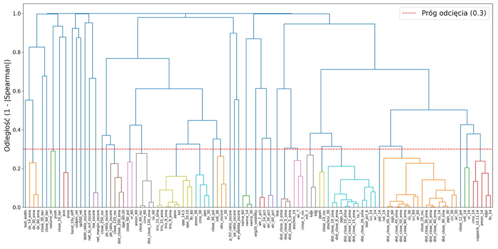

3.  **Selecting leaders via Mutual Information (MI):** From each cluster, one representative (leader) with the highest average Mutual Information score against the logarithmic rate of return across three forecast horizons (5, 21, 63 days ahead) was selected. MI, based on entropy, can flawlessly identify complex non-linear dependencies undetectable by classic linear correlation.
4.  **XGBoost predictive modeling and SHAP value analysis:** The reduced set of cluster leaders served as input for an XGBoost regression model (shallow trees max_depth = 5, learning_rate = 0.05, 150 estimators, subsample/colsample = 0.8 to prevent feature dominance). To analyze predictive importance, **SHAP (Shapley Additive exPlanations)** values from cooperative game theory were used. They fairly price the marginal contribution of each variable, considering non-linear interactions with other features.

#### Predictive importance ranking of indicators determined based on averaged Shapley values for time window index 1
The chart illustrates the averaged marginal SHAP contribution for individual input features, revealing a strong asymmetry and the dominance of key indicators.
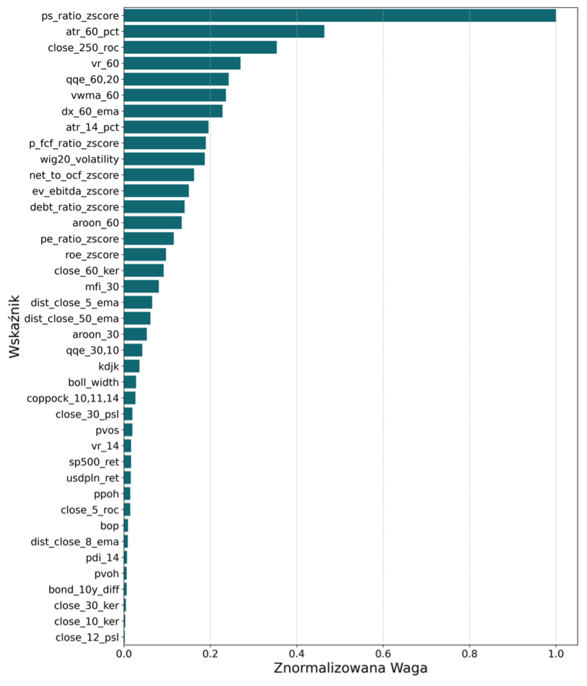

5.  **80% selection criterion:** Variables were ranked descending by SHAP values and sequentially included in the final basket until their cumulative impact reached a threshold of **80% of total predictive power**. This constrained the state space to merely **13–14 key variables**, drastically increasing network optimization stability and preventing overfitting.

#### Overview of selected variables along with their predictive power in the pre-selection process
Presents the dynamic evolution of the selected variable set across the 4 individual research windows. A universal core of fundamental indicators (e.g., `ps_ratio_zscore`, `p_fcf_ratio_zscore`, `net_to_ocf_zscore`) and technical indicators (e.g., `close_250_roc`, `aroon_60`, `atr_60_pct`, `qqe_60,20`, `vr_60`) persisting across all periods is visible.
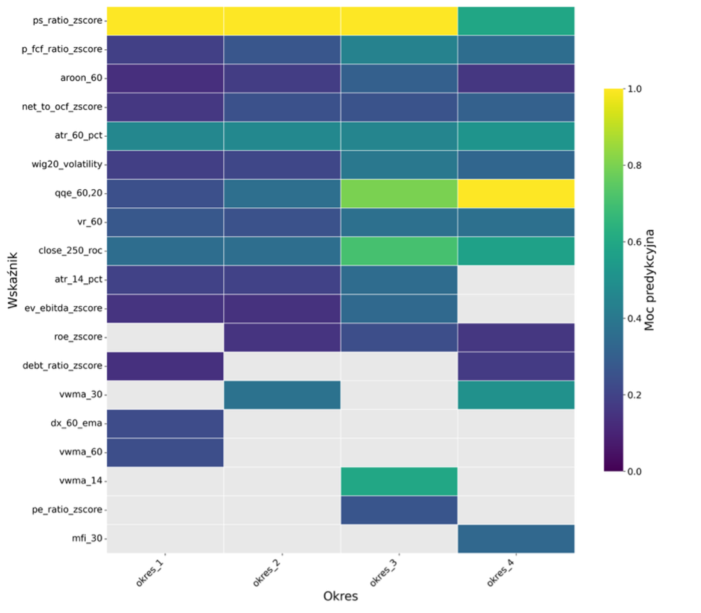

---

## 5. Realistic Simulation Environment (StockTradingEnv)

The transactional process was formalized as a **Markov Decision Process (MDP)**, where in each step $t$ the agent observes the environment state $s_t$, takes an action $a_t$ (a decision vector of dimension $N=16$ from the interval $[-1, 1]$), receiving a reward $r_t$ and transitioning to state $s_{t+1}$. 

The dimension of the state space vector is $1 + 2N + NK$ (where $N=16$ companies, and $K$ is the number of selected indicators), storing: cash balance, closing prices of companies, volumes of owned shares, and indicator values for each asset.

### Proprietary Modifications (Adaptation to the XTB platform)
The classic `StockTradingEnv` trading environment from the FinRL library relies on idealistic market assumptions (infinite liquidity, instant order execution), creating a serious simulation-to-reality gap and drastically worsening model results in real trading. The study introduced **a series of proprietary modifications**, reflecting actual trading regulations and costs of the **XTB** platform:

1.  **Execution Delay:** In the original environment, the agent makes decisions and executes them immediately at closing prices on the same trading day $t$. In reality, this is impossible. In the modified environment, the agent generates trading decisions based on closing prices from day $t$, but transactions are executed only at the **opening price of the following trading day ($t+1$)**. This allows for the inclusion of overnight gap risk.
2.  **Budget Scaling mechanism:** Original FinRL processes buy orders in a simple chronological loop by company indices. If the agent wants to commit more capital than its free balance allows, purchases are executed greedily, and orders for companies at the end of the list are rejected due to lack of funds, grossly distorting the intended portfolio structure. A mechanism was implemented where the network's signal is treated as a target allocation weight. The system first executes sell orders (freeing capital), and if the total value of planned purchases exceeds the cash balance, it **proportionally scales down buy volumes for all companies**, preserving the expenditure structure designed by the agent.
3.  **Introduction of fractional shares and minimum thresholds:** The requirement to trade exclusively in full share units was abandoned in favor of **trading fractional shares (with a precision of 4 decimal places)**, which is crucial for precise allocation in assets with a high unit price (e.g., LPP S.A.). Simultaneously, a strict minimum order value threshold of **10 PLN** was implemented (in accordance with XTB's offer) — orders below this amount are rejected (unless an open position is completely closed, in which case this limit is ignored).
4.  **Transaction costs:** A fixed commission rate of **0.10%** of the order value was imposed for every buy and sell operation. Although XTB offers 0% commission up to a trading limit of 100,000 EUR per month, imposing a 0.1% cost is a recommended academic practice, reflecting hidden market costs: price spread and price slippage during order execution.
5.  **Dynamic HMAX parameter:** Instead of the default constant value for the maximum transaction volume (which favored committing capital into nominally cheaper stocks), the HMAX parameter is determined dynamically for each asset as the ratio of initial capital (100,000 PLN) to the maximum historical stock price of the company from the assigned training period.

### Logarithmic Reward Function
Instead of the default, absolute change in portfolio value ($V_{t+1} - V_t$), which is susceptible to capital scale and non-stationarity, a **logarithmic rate of return** was implemented:

$$r_t = \ln\left(\frac{V_{t+1}}{V_t}\right)$$

The sum of rewards defined this way over the entire episode is mathematically equivalent to the logarithm of the ratio of final to initial capital. It is characterized by additivity over time, higher stationarity, and provides the agent with dense reward feedback. Due to the extremely small daily values of return rates, the reward was multiplied by the parameter `reward_scaling = 100`. As a result, the variance of rewards oscillates around one, eliminating the phenomenon of vanishing or exploding gradients during network optimization.

---

## 6. Training Methodology and Hyperparameter Tuning

### Validation Criterion: Sortino Ratio
Proper training on in-sample data covers 100 episodes (approx. 145,000 time steps). To select the optimal model form, a callback was implemented to periodically evaluate the agent's deterministic policy on the validation set. The **Sortino Ratio** was chosen as the target optimization metric:

$$S = \frac{R_p - R_f}{\sigma_d}$$

where $R_p$ is the annualized rate of return, $R_f$ is the risk-free rate (assumed as 0), and $\sigma_d$ is the standard deviation of negative returns (asymmetric downside volatility). 

**Rationale for the method:** The classic Sharpe ratio penalizes volatility symmetrically — imposing the same penalty for severe drops as for unexpected, high rates of return (which also raise variance). Sortino approaches risk asymmetrically: it penalizes solely downside volatility (loss risk), without limiting the rewarding of models for generating high profits during strong upward trends.

Observation normalization (balances, prices, indicators) was realized using the `VecNormalize` wrapper from Stable Baselines 3, standardizing states to a distribution with a mean close to zero and unit variance, clipping extreme values to a level of 10.0 standard deviations.

### Bayesian Optimization (TPE in Optuna) with Seed Variance Control
Reinforcement learning exhibits extreme sensitivity to hyperparameters and high variance in results stemming from the **random seed** (random initialization of neural network weights, environment exploration). Evaluating a model on a single random seed leads to erroneous conclusions and masks the problem of overfitting to specific information noise.

To prevent this, an advanced tuning procedure was implemented:
*   The **Optuna** library and the **TPE (Tree-structured Parzen Estimator)** estimator were utilized as a Bayesian optimization algorithm (budget of 50 trials; first 5 iterations in pure random mode). TPE models the distribution of hyperparameters probabilistically, maximizing Expected Improvement.
*   Each hyperparameter combination was evaluated in parallel on **three independent random seeds**. 
*   **Objective function:** The ultimate criterion for evaluating the optimizer was the **median Sortino ratio reduced by the standard deviation** from the obtained three runs. This allowed for the automatic rejection of high-variance (unstable) architectures in favor of highly reproducible models.
*   To save computational time, **MedianPruner** was implemented (n_startup_trials = 5, n_warmup_steps = 3). The pruner verifies results every 10 episodes and interrupts trials worse than the median of previous trials at the exact same learning stage and specific seed (crucial for consistency in comparisons).

The tuning covered: hidden layer architecture, activation functions (Tanh, ReLU), L2 regularization (weight decay), discount factor ($\gamma$), learning rate, batch size, entropy coefficient, and algorithm-specific parameters (e.g., planning horizon $n\_steps$, memory buffer, exploration noise parameters). For complement-to-one parameters (e.g., $\gamma$ and $\lambda$ in GAE), log-uniform sampling was applied to their complement ($1-\gamma$), ensuring the desired sampling density close to the value of 1.0.

Hyperparameter tuning brought a significant increase in the median Sortino ratio across all windows and for all algorithms compared to the default Stable Baselines 3 parameters.

---

## 7. Stochasticity Management: Multi-agent Ensembles (Ensemble Learning)

### Statistical Rationale
Simulation results based on signals from individual agents trained on different random seeds exhibit an immense spread (equity curves ranging from severe losses to high profits), proving that a single model is too unstable to be entrusted with real capital.

#### Divergence in equity curve trajectories in the test simulation based on single-agent signals (100 runs)
This chart illustrates the enormous variance and spread of results from individual models trained on identical data and hyperparameters, differing only in the random seed.
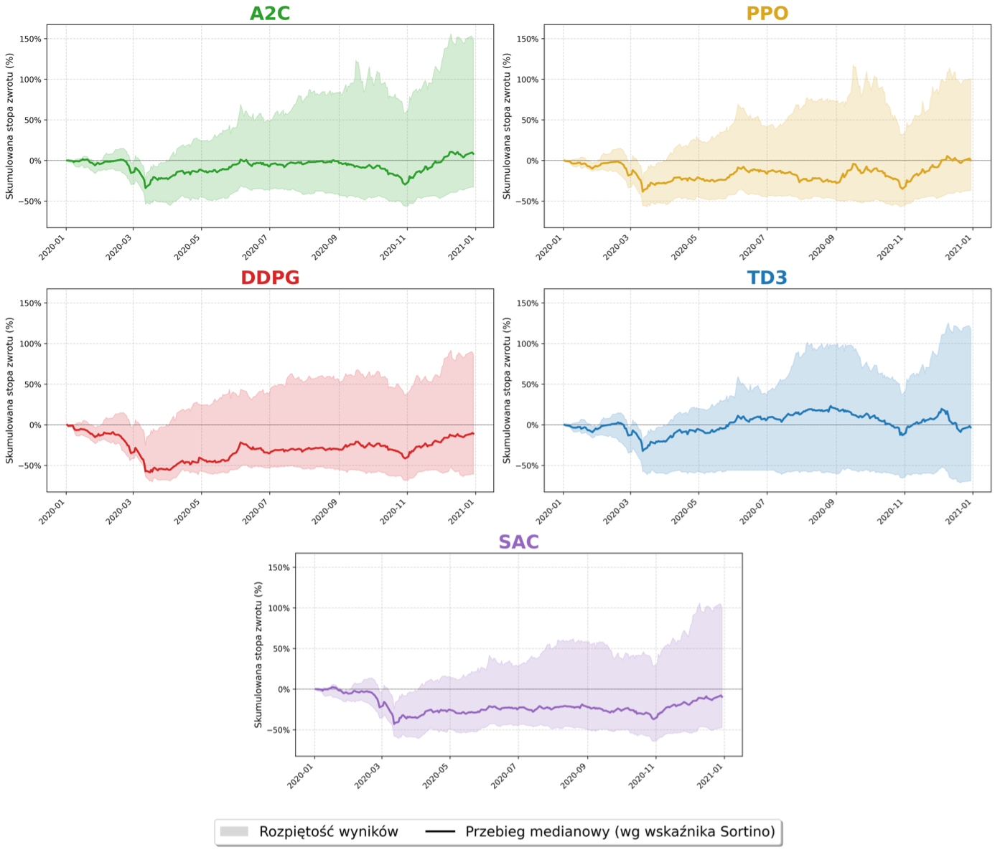

To reduce variance, **Ensemble Learning** methods were implemented, creating multi-agent ensembles. This approach rests on solid mathematical foundations:
*   **Law of Large Numbers:** A single stochastic learning run is just one realization of a random variable. According to the LLN, the arithmetic mean from a sample of independent realizations asymptotically approaches its stable expected value as the ensemble size $N$ increases.
*   **Estimator variance reduction:** For the sum of $N$ variables with equal variance $\sigma^2$ and an average correlation coefficient $\rho$, the variance of the averaged signal is expressed by the formula:
    $$\text{Var}(\bar{X}) = \rho \sigma^2 + \frac{1 - \rho}{N} \sigma^2$$
    As the ensemble size $N$ grows, the second term approaches zero, and the total ensemble variance asymptotically approaches $\rho \sigma^2$. Because the models exhibit varied state mappings (generating errors with correlation $\rho < 1$ thanks to learning stochasticity), averaging signals guarantees a strong reduction in the output variance of the investment decision.

### Signal Aggregation Variants
Three variants of ensemble creation were implemented (ensemble size was tested in the range from $N=1$ to $N=50$ using bootstrapping with replacement methodology, $B=30$ iterations):
1.  **Winner Ensemble (WIN - Winner):** In each test quarter, capital is allocated exclusively based on the decisions of that base ensemble which achieved the highest median Sortino in the preceding validation window. This allows for flexible model rotation depending on the prevailing market regime.
2.  **Average Ensemble (AVG - Average):** A simple arithmetic mean of decision signals (from the interval $[-1, 1]$) generated by its constituent base ensembles, aimed at maximum diversification of investment styles.
3.  **Softmax Weighted Ensemble (SMOOTHED):** A variant in which the weight (voting power) of individual algorithms is determined using the Softmax function applied to their Sortino ratios from the validation window. This prioritizes models with the highest historical effectiveness.

### Signal Stability Analysis
The impact of ensemble size ($N$) on stochastic noise reduction is presented in the charts below.

#### Impact of ensemble size (N) on standard deviations of raw signals
Visualizes the empirical drop in standard deviation of raw trading signals as the number of agents in the ensemble increases, confirming the absorption of stochastic noise.
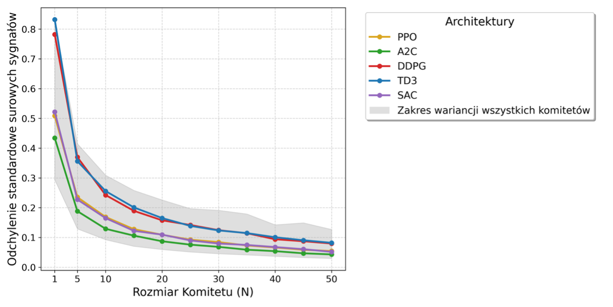

#### Mean Absolute Change of raw signals (MAC) depending on ensemble size (N)
MAC measures the average signal difference between an ensemble of size $N$ and $N-\text{previous}$. The chart shows a strong deceleration of changes around $N \ge 20$, although the curve descends all the way to $N = 50$, indicating consistent benefits from expanding the ensemble.
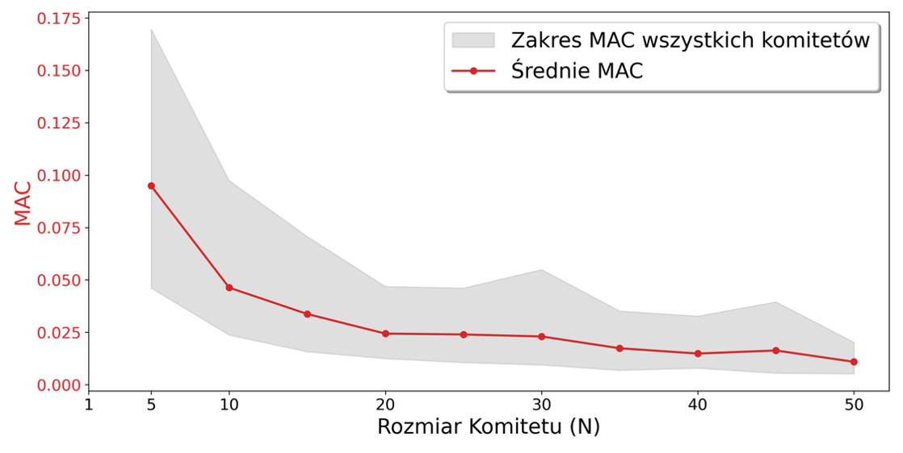

---

## 8. Research Results and Key Findings

### Reference Strategy (Benchmark) Results
While the year 2020 brought a market collapse, classic passive and active allocation strategies suffered severe losses:
*   **Buy&Hold (passive market):** Cumulative return was **-8.87%** with a Maximum Drawdown equal to **-44.86%**.
*   **Min-Variance (Markowitz minimum variance portfolio):** Result at the level of **-13.57%** with a drawdown of **-40.33%**.
*   **Mean-Semivariance (Sortino ratio optimization in-sample):** Result at the level of **-4.37%** with a maximum drawdown of **-44.41%**. This strategy behaved like a momentum portfolio, allocating heavily into CD Projekt S.A., which translated into severe losses during the December crash of this company's valuation.

#### Equity curve trajectories over time for benchmarks
Visualization of the behavior of classic reference strategies in 2020, revealing severe drawdowns in March and December.
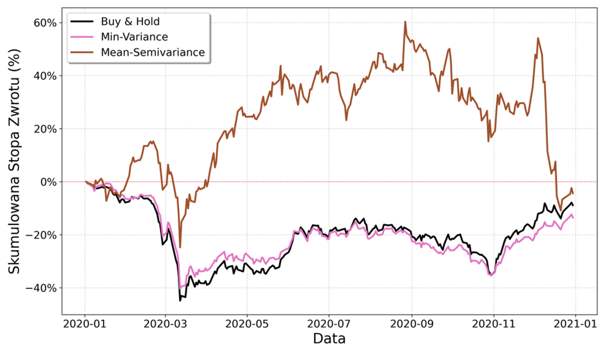

### Effectiveness of DRL Ensembles and Noise Filtering
The introduction of ensemble learning fundamentally altered the investment performance profile. The following charts and statistical analyses confirm the outstanding superiority of averaged DRL models over traditional benchmarks.

#### Convergence of investment strategy quality metrics regarding ensemble size (N)
As $N$ increases, there is a drastic narrowing in the spread of results (Sharpe, Sortino, Calmar, Rate of Return) and a distinct rise and stabilization of their medians at levels significantly exceeding benchmark results.
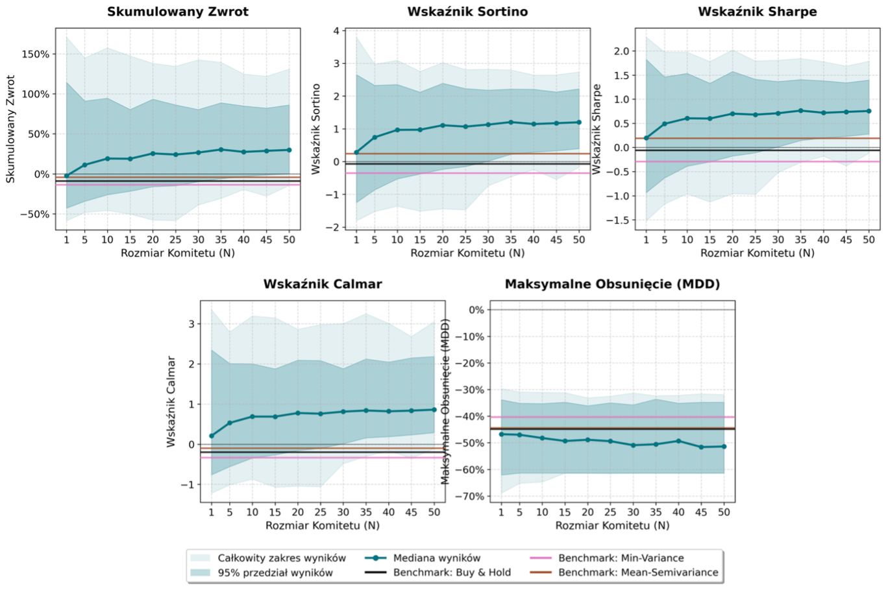

#### Comparison of density distributions of obtained metrics by ensembles of size N = 1 and N = 50
For $N=1$, distributions are flat with high variance (standard deviation of returns around 0.38), with significant mass below zero. For $N=50$, distributions are strongly concentrated around high, positive mean values (standard deviation drops to 0.23, and the average return rises from 7% to 34%).
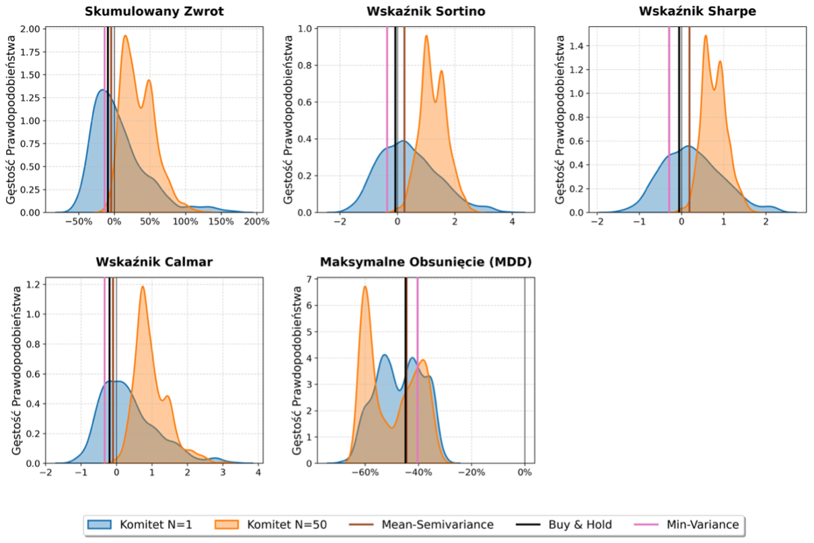

#### Impact of ensemble size (N) on the percentage of instances outperforming the Buy&Hold benchmark and generating a positive return
At $N=1$, only 59.6% of models beat the passive market, and merely 47.6% generate a positive profit. Increasing the ensemble size to $N=50$ guarantees near-certain market superiority: **99.6% of ensembles beat Buy&Hold**, and **97.6% finish the year with a positive return** (analogous, near-unit effectiveness was recorded for risk-adjusted metrics).
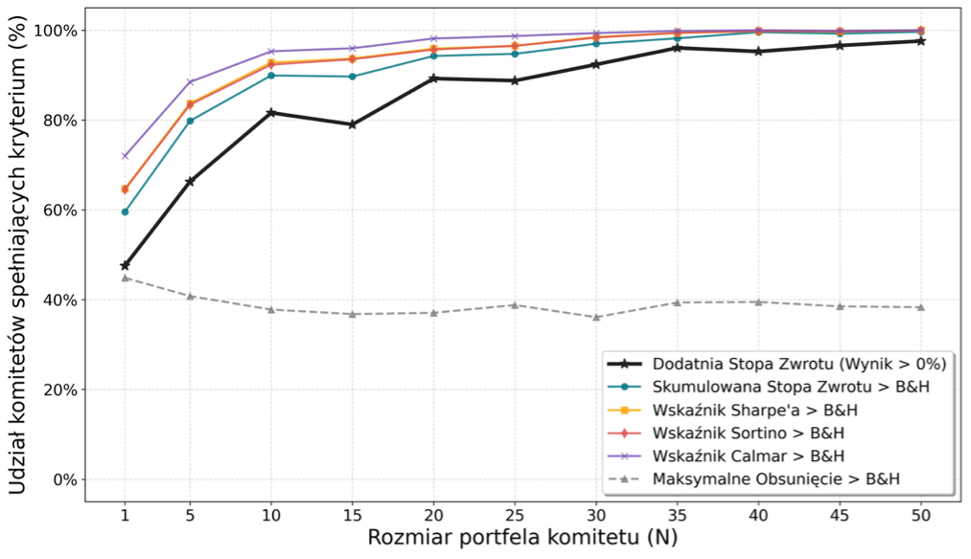

### Behavior Analysis during the Crash (Q1 2020) and the Rebound Bull Market
Despite outstanding final returns, the models exhibited a significant weakness in downside risk control: merely 38.31% of instances for ensembles of size $N=50$ managed to limit maximum capital drawdown more effectively than the passive Buy&Hold market, and against the minimum variance portfolio, this percentage dropped to 24.22%.

The cause of this phenomenon is explained by dynamic analysis:

#### Equity curve area across 30 iterations of ensembles of size N = 50 against benchmarks
Ensemble equity curves during the pandemic panic period (Q1 2020) directly follow the downward trend of the broader market, recording severe drawdowns in the range of 32–61%.
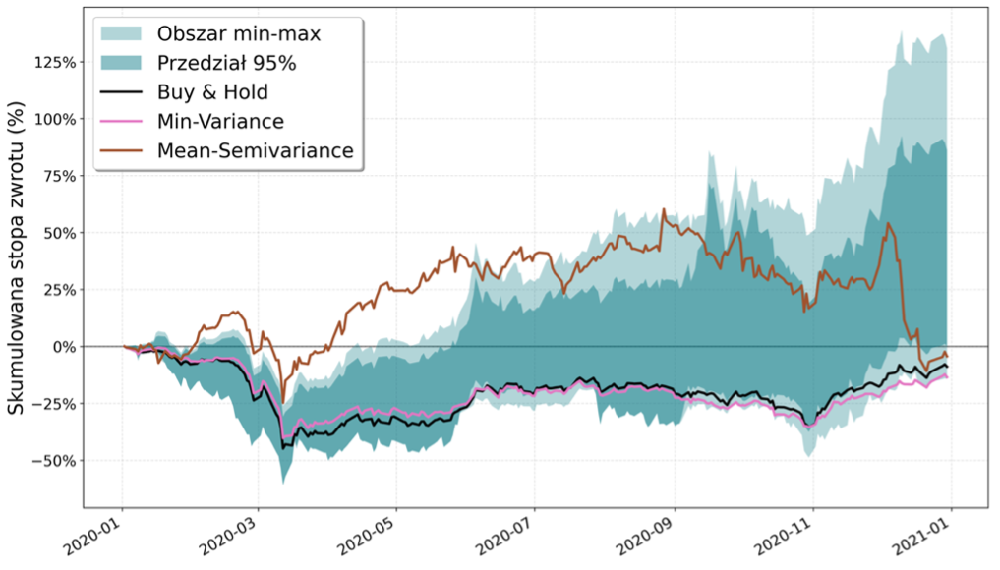

#### Stock price change dynamics for portfolio companies in Q1 2020
Shows a sudden and synchronized drop in prices of nearly all assets in the first quarter, eliminating the benefits of traditional diversification.
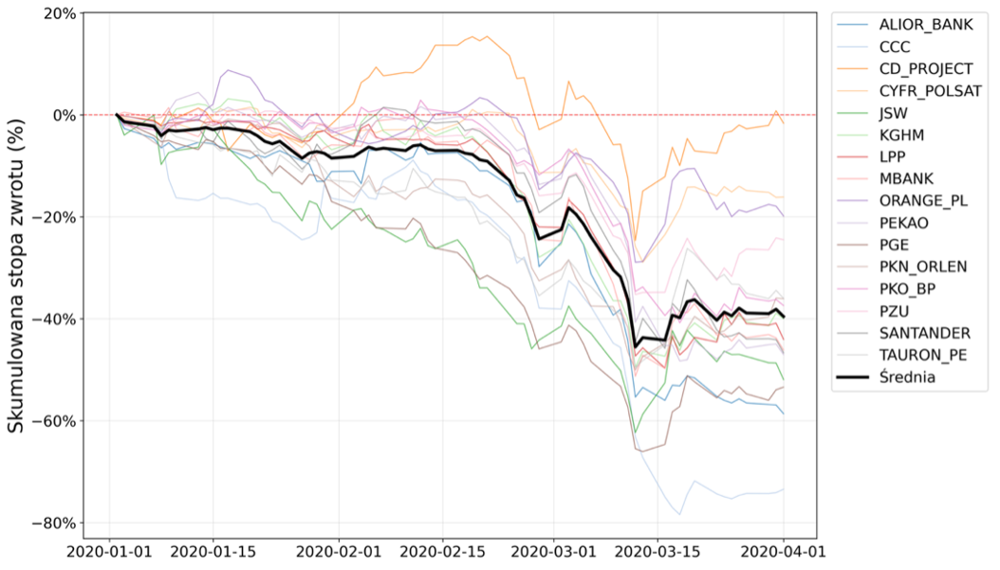

**Key observation:** DRL agents exhibit a lag in detecting sudden, unprecedented crashes and are unable to evacuate capital 100% to safe cash quickly enough, causing them to fully participate in the first phase of market panic. However, the moment the market enters the phase of dynamic recovery (from Q2 2020), agents display an outstanding ability for **aggressive and incredibly accurate allocation of funds into companies with the strongest identified growth potential**. This allows ensembles to more than recoup the losses from the first quarter and generate spectacular return rates by the end of the year.

The highest effectiveness was demonstrated by the **winner ensemble (WIN) combining A2C, PPO, and TD3 algorithms** at a size of $N=50$. It generated a median cumulative return of **86.00%** and a Sortino ratio of **2.10** (returns fluctuated in the range of 50% to 130% depending on the random seeds), creating a colossal surplus over the negative results of traditional strategies.

#### Equity curve area across 30 iterations of the ensemble with the highest median quality metrics (size N = 50) against benchmarks
The chart depicts the spectacular trajectory of recovering losses and maximizing profits by the winning multi-agent ensemble (A2C + PPO + TD3) during the market rebound phase.
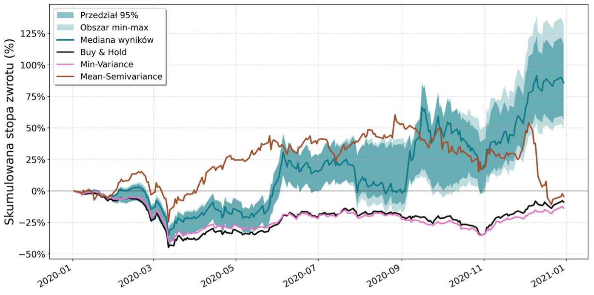

---

## 9. Future Work Directions

The conducted research opens promising prospects for the development of automated trading systems on the Polish capital market while defining areas requiring further research:
1.  **Integration of Alternative Data Sources (NLP):** Enriching the state space with market sentiment analysis from financial news, analytical reports, and social media using large language models (LLM) or text analysis techniques.
2.  **Advanced Reward Function Design:** Experimenting with reward functions that directly incorporate risk metrics (e.g., a reward based directly on the Sortino or Calmar ratio calculated over a rolling in-sample window), which could stimulate agents to better protect capital during crash phases.
3.  **A Priori Ensemble Performance Forecasting:** Developing predictive models (classifiers or supervised regressors) capable of estimating the future effectiveness of a specific ensemble composition based on current market and macroeconomic metrics, prior to exposure to real market risk.
4.  **Explainable AI (XAI) in RL:** Implementing methods for interpreting agent decisions (e.g., dynamic SHAP values calculated at every time step for the actor's neural network), which constitutes a crucial condition for the approval and full adoption of deep reinforcement learning systems by financial institutions and investment funds.
